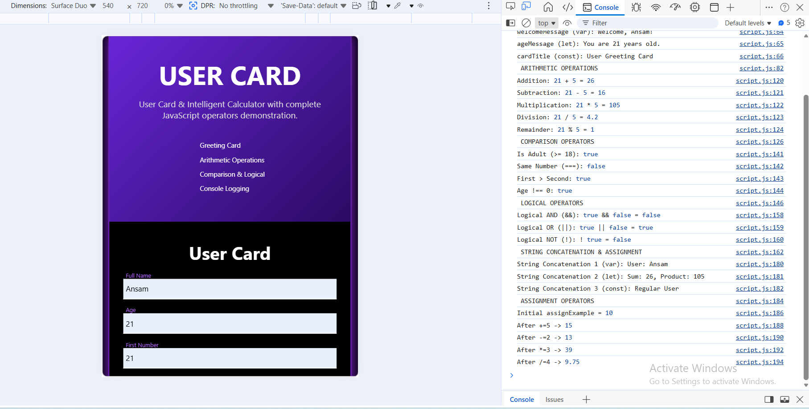

# User Card & Intelligent Calculator

A comprehensive JavaScript learning project demonstrating all fundamental operators and data types.

## Project Overview

This project provides an interactive web application with a modern UI that covers essential JavaScript concepts:
- **console.log** for debugging
- Variable declaration: `var`, `let`, `const`
- Data types: `string`, `number`, `boolean`
- Operators: arithmetic, assignment, comparison, logical, and string concatenation

**No arrays used** - focuses on single values and operations.

## Features

- **Greeting Card**: Display user information with data type logging in console
- **Smart Operations**: Execute arithmetic, comparison, logical, and string operations with visible result cards
- **Results Display**: Modern card-based UI with Font Awesome icons
- **Console Logging**: All operations logged to browser console for debugging

## Files

- `index.html` - Main HTML structure with modern UI
- `script.js` - JavaScript logic for greeting and smart operations
- `style.css` - Advanced styling with gradients and animations
- `README.md` - This documentation file

## Topics Covered

| Operator Type | Examples |
|---|---|
| **Arithmetic** | `+`, `-`, `*`, `/`, `%` |
| **Assignment** | `=`, `+=`, `-=` (via var/let/const) |
| **Comparison** | `===`, `!==`, `>=`, `>`, `<` |
| **Logical** | `&&` (AND), `||` (OR), `!` (NOT) |
| **String** | `+` (concatenation) |

## How to Run

1. **Open the project folder** `JS-Smart-Card-Calculator-JH`
2. `index.html`  open it in your browser
3. **Fill in the form**:
   - Full Name
   - Age (number)
   - First Number (number)
   - Second Number (number)
4. **Click Buttons**:
   - **Greeting Card**: Creates a greeting and logs data types
   - **Smart Ops**: Executes all operations and displays results

## Console Output

Open Developer Tools (Press F12) → **Console** to see:
- Data types for each variable
- Arithmetic operations results
- Comparison operator results
- Logical operator results
- String concatenation results
  

## Example Usage

```javascript
const userName = "Ansam";           // string
const userAge = 21;                 // number
const num1 = 21;                    // number
const num2 = 5;                     // number

// Arithmetic
const sum = num1 + num2;            // 26

// Comparison
const isAdult = userAge >= 18;      // true

// Logical
const valid = isAdult && sum > 10;  // true

// String concatenation
const greeting = "Hello, " + userName + "!";  // "Hello, Ansam!"
```

## Browser Compatibility

Works on all modern browsers with ES6 support:
- Chrome
- Firefox
- Safari
- Edge

## Author Notes

This project is designed for JavaScript beginners to understand:
- How operators work with different data types
- Proper use of var, let, and const
- Console logging for debugging
- DOM manipulation for displaying results
